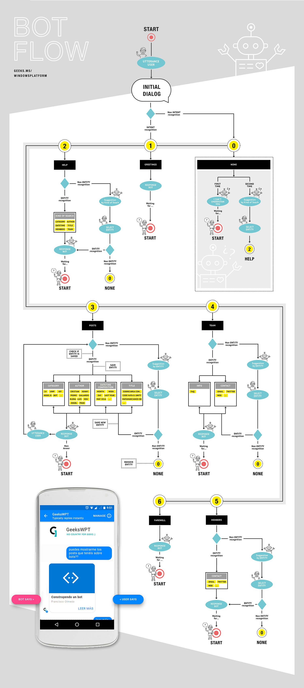

# Cactusín Bot

Proyecto de un Bot conversacional para proveer al usuario de información referente al [blog](http://www.nocountryforgeeks.com/) y al equipo de No Country for Geeks.

## Bot Framework con Node.js

Para el desarrollo de este bot hemos trabajado con el [Bot Framework](https://dev.botframework.com/) de Microsoft sobre Node.js.

En la [documentación](https://docs.microsoft.com/en-us/bot-framework/resources-tools-downloads#bot-builder-sdk-for-nodejs) podéis ver cómo empezar a trabajar con Node.js para crear vuestro propio bot con Bot Framework.

## Publicación

Bot Framework te ofrece la posibilidad de crear un solo bot y desplegarlo en múltiples plataformas como Skype, Facebook Messenger, Slack, Telegram, etc.

En nuestro caso hemos decidido publicarlo para Facebook. De esta forma la gente que entre a la página de Facebook de [No Country for Geeks](https://www.facebook.com/463217730714163) podrá interactuar con nuestro bot para saber más sobre nosotros y nuestro blog.

### Registro en Facebook

Para configurar el bot en Facebook debemos acceder al [portal de desarrolladores](https://developers.facebook.com/) de Facebook, crear una nueva aplicación y configurar el acceso al Facebook Messenger.

En la [documentación](https://docs.microsoft.com/en-us/bot-framework/channel-connect-facebook) de Microsoft podemos ver paso a paso como conectar Bot Framework con Facebook.

## Objetivo

El objetivo del proyecto es crear un bot que sea capaz de dar información al usuario sobre los miembros y el blog de No Country for Geeks.

Información referente al blog como los posts filtrados por fecha, categoría, autor etc.

Además, ofrecer información sobre los miembros como por ejemplo la información de contacto, proyectos, etc.

Todo el **flujo del bot lo hemos definido en el [post de Elena](www.nocountryforgeeks.com/bot-flow-and-luis/
)** que tenemos publicado en nuestro blog.

Para eso vamos a separar el desarrollo en diferentes fases.  

### Fase 0

En la fase 0 el objetivo es tener un Bot publicado en nuestra página de Facebook que sea capaz de dar al usuario la información básica y llevarlo al blog.

Esto es básicamente el proyecto por defecto de un bot en Node.js pero con unos mensajes personalizados.

Aquí aún no entra a jugar LUIS ya que no tenemos que identificar nada sobre los mensajes del usuario puesto que siempre vamos a contestar con la misma información.

### Fase 1

En la fase 1 tenemos que integrar LUIS con nuestro Bot para poder identificar las intenciones del usuario y actuar en consecuencia.

En esta fase el Bot solo será capaz de contestar a la información referente a los posts.

Además, debe ser capaz llevar al usuario al blog para el resto de temas que no sepa responder.

### Fase 2

En esta última fase el bot tiene que estar completamente terminado con acceso a todo lo que hemos mostrado en el flujo.

## Flujo del bot

A continuación podéis ver el flujo completo que tiene el bot.



## Configuración del despliegue

Para desplegar el bot es necesario el **AppId** y **PasswordId** que los obtenemos desde la configuración de nuestra aplicación en el portal de Bot Framework.

En nuestro caso **el bot obtiene estos valores desde las variables de entorno**. Por tanto, donde despleguemos el bot debemos crear las variables `MICROSOFT_APP_ID` y
`MICROSOFT_APP_PASSWORD`.

```js
var connector = new builder.ChatConnector({
    appId: process.env.MICROSOFT_APP_ID,
    appPassword: process.env.MICROSOFT_APP_PASSWORD
});
```

Si desplegamos en Azure con un App Service de Linux podemos crear las variables de entorno desde la Configuración de la Aplicación.

## Datos de contacto

Puedes ponerte en contacto con nosotros para cualquier duda del proyecto.

* [Elena Pérez](http://www.nocountryforgeeks.com/author/elenaps/)
* [Sergio Gallardo](http://www.nocountryforgeeks.com/author/gallardo/)
* [Ángel López](http://www.nocountryforgeeks.com/author/aclopez/)
